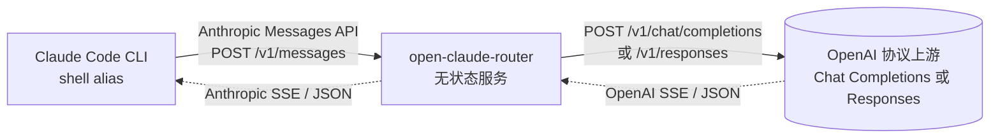

<p align="center">
  
</p>

<h1 align="center">open-claude-router</h1>

<p align="center">
  把任意 OpenAI 兼容上游"包装成" Anthropic Messages API，让 <a href="https://docs.anthropic.com/claude/docs/claude-code">Claude Code</a> 能直接使用。
</p>

<p align="center">
  <a href="https://nodejs.org/"></a>
  <a href="https://hub.docker.com/r/riba2534/open-claude-router"></a>
  <a href="https://github.com/riba2534/open-claude-router/stargazers"></a>
  <a href="https://github.com/riba2534/open-claude-router/blob/main/LICENSE"></a>
</p>

---

## 这是什么

[Claude Code](https://docs.anthropic.com/claude/docs/claude-code) 只接受 Anthropic Messages API，但你想用的模型可能跑在 OpenAI 协议上——OpenAI 官方、第三方聚合网关、自托管推理服务。这个项目就是夹在中间的**协议转换桥梁**：

```
Claude Code  ──(Anthropic Messages)──▶  open-claude-router  ──(OpenAI Chat Completions / Responses)──▶  上游
```

跟其他类似工具最大的差异：**服务端无状态**。所有上游信息（URL、Authorization、模型名）由客户端逐请求通过 HTTP header 或 URL path 传入——服务端不读本地配置、不存任何 API Key、不维护 provider 列表。一份部署可以同时服务任意客户端、任意上游。

典型场景：

- **个人自部署**：`docker run` 一行起，shell alias 里写你的上游凭证
- **团队共享**：内网起一份部署，每人 alias 里写各自的上游和 token，**凭证完全留在客户端，服务端无需集中管理**
- **多家上游切换**：不同 alias 指向不同上游 / 模型，无需重启服务

## 目录

[特性](#特性) · [架构](#架构) · [快速开始](#快速开始) · [协议覆盖与边界](#协议覆盖与边界) · [API](#api) · [环境变量](#环境变量) · [常见问题](#常见问题) · [安全](#安全) · [致谢](#致谢)

## 特性

- **服务端无状态**：服务侧不存任何 API Key、不读本地配置、不维护 provider 列表；上游信息全部由客户端逐请求传入（配置都在客户端 alias 里）
- **任意 Authorization 格式**：标准 `Bearer sk-...`、企业网关常见的非 Bearer 自定义协议头都能原样透传
- **完整覆盖 Claude Code 协议**：流式 SSE、工具调用（`tool_use` / `tool_result` 双向增量）、多模态图片、`thinking` 块（覆盖范围与限制见下方["协议覆盖与边界"](#协议覆盖与边界)表）
- **同时支持 OpenAI 两套协议**：默认走 Chat Completions（兼容 OpenAI 官方、OpenRouter、各类 OpenAI 兼容网关 / Kimi / DeepSeek 等），通过 `X-Upstream-Format: responses` opt-in 切到 Responses API（OpenAI o-series / gpt-5 原生协议，含 reasoning summary 转 Anthropic `thinking` 块）
- **alias 里完成全部配置**：模型映射、上游 URL、上游凭证、服务鉴权、额外网关 header 都能通过 Claude Code alias 注入
- **模型名映射**：客户端保留 `claude-*` 名称以启用 Claude Code 能力，上游收到真实模型名
- **两种接入方式**：上游信息可以放 HTTP header，也可以直接拼在 URL path 里
- **轻量好部署**：esbuild 打包后单文件 ~70 KB，Docker 镜像几十 MB，开箱即用

## 架构



服务收到 Anthropic 协议的请求后，从 HTTP header 或 URL path 解析出真实上游 URL 和 Authorization，把请求体转成对应的 OpenAI 协议（默认 Chat Completions，可通过 `X-Upstream-Format: responses` 切到 Responses API）调用上游，再把上游响应（SSE 流或 JSON）转回 Anthropic 格式返回。整个过程不读本地配置、不存任何凭证、不维护 provider 表，因此**无状态、可任意水平扩展**。

## 快速开始

### 1. 启动服务

推荐用 Docker 一键启动（镜像在 [Dockerhub](https://hub.docker.com/r/riba2534/open-claude-router)，amd64 + arm64 双架构）：

```bash
docker run -d --name ocr --restart unless-stopped -p 3457:3457 \
  riba2534/open-claude-router:latest
```

服务监听 `:3457`，服务端无需任何配置即可启动。公网部署可加 `-e OCR_ACCESS_TOKENS=token1,token2`（`OCR` 即 open-claude-router 缩写）启用访问鉴权。

启动后验证服务就绪：

```bash
curl http://localhost:3457/healthz   # 预期 {"status":"ok"}
```

> 端口被占用时改宿主端口即可，例如 `-p 13457:3457`，并把下面 alias 里的 `localhost:3457` 同步改成 `localhost:13457`。

<details>
<summary>开发者：自己构建 / 用 npm 跑</summary>

```bash
# 自己构建镜像
docker build -t open-claude-router .
docker run -d --name ocr --restart unless-stopped -p 3457:3457 open-claude-router

# 或直接用 npm 跑（tsx watch 模式）
npm install
npm run dev
```
</details>

### 2. 配置 Claude Code alias

三种方式的区别只在"上游凭证放哪 / 服务鉴权走哪 / 用哪套 OpenAI 协议"，按需挑一种：

| 方式 | 上游凭证位置 | `ANTHROPIC_AUTH_TOKEN` 含义 | 服务鉴权 header | 适用 |
|---|---|---|---|---|
| **A** path 内嵌 | URL path | **上游凭证**（剥 `Bearer ` 前缀后透传上游） | `X-OCR-Token` | 最简洁，单上游直连 |
| **B** 自定义 header | `X-Upstream-Authorization` header（URL 走 `X-Upstream-Url`） | **服务自身鉴权 token** | `Authorization: Bearer` | 上游凭证不进 URL、或需服务鉴权 |
| **C** Responses API | 同 A | 同 A | 同 A | 接 o-series / gpt-5 原生 reasoning（在 A 基础上加 `X-Upstream-Format: responses`） |

> ⚠️ `ANTHROPIC_AUTH_TOKEN` 在 path 模式（A/C）里是**上游凭证**，在 header 模式（B）里是**服务自身鉴权 token**——别填反，否则上游 401。
>
> **多 header 写法**：`ANTHROPIC_CUSTOM_HEADERS` 以换行分隔多个 header，所以多个 header 必须用 bash/zsh 的 `$'...\n...'`（ANSI-C 引用，让 `\n` 成为真实换行）；只有一个 header 时用普通单引号 `'...'` 即可。非 bash/zsh shell（如 fish）引用语法不同，需自行转换。

#### 方式 A：URL path 内嵌上游（推荐，复制一个 alias 即可）

把上游完整 URL 直接拼在服务地址后面：

```bash
alias myocr="ANTHROPIC_BASE_URL=http://localhost:3457/https://api.openai.com/v1/chat/completions \
ANTHROPIC_AUTH_TOKEN='Bearer sk-proj-xxxxx' \
ANTHROPIC_CUSTOM_HEADERS='X-Upstream-Model-Map: claude-opus-4-6=gpt-5.5,claude-sonnet-4-6=gpt-5.4,claude-haiku-4-5-20251001=gpt-5.4-mini' \
ANTHROPIC_MODEL=claude-sonnet-4-6 \
ANTHROPIC_DEFAULT_SONNET_MODEL=claude-sonnet-4-6 \
ANTHROPIC_DEFAULT_OPUS_MODEL=claude-opus-4-6 \
ANTHROPIC_DEFAULT_HAIKU_MODEL=claude-haiku-4-5-20251001 \
claude"
```

（这里只有一个 header，用普通单引号即可；下面方式 B/C 有多个 header，才需要 `$'...\n...'`。）

Claude Code 侧仍使用 `claude-*` 名称，能力检测和 `/model opus` 等槽位切换保持正常；上游实际收到 `gpt-5.4` / `gpt-5.5` / `gpt-5.4-mini`。

> **`ANTHROPIC_AUTH_TOKEN` 应填上游需要的完整 Authorization header 值。** Claude Code 客户端会自动加 `Bearer ` 前缀，服务在 path 模式下会剥掉这一层后透传给上游：
>
> - 上游期望 Bearer 鉴权（OpenAI 等）→ 写 `'Bearer sk-...'`
> - 上游期望非 Bearer 自定义协议头 → 写 `'custom-scheme://...?key=...'`

如果服务端启用了 `OCR_ACCESS_TOKENS` 白名单（公网部署强烈建议），path 模式下 `Authorization` 已经被上游凭证占用，需要额外通过 `ANTHROPIC_CUSTOM_HEADERS` 传 `X-OCR-Token` 做服务侧鉴权：

```bash
alias myocr="ANTHROPIC_BASE_URL=http://your-bridge.example.com/https://api.openai.com/v1/chat/completions \
ANTHROPIC_AUTH_TOKEN='Bearer sk-proj-xxxxx' \
ANTHROPIC_CUSTOM_HEADERS=$'X-OCR-Token: mytoken1\nX-Upstream-Model-Map: claude-opus-4-6=gpt-5.5,claude-sonnet-4-6=gpt-5.4,claude-haiku-4-5-20251001=gpt-5.4-mini' \
ANTHROPIC_MODEL=claude-sonnet-4-6 \
... \
claude"
```

#### 方式 B：自定义 header 传上游（更灵活，支持服务自身鉴权）

```bash
alias myocr="ANTHROPIC_BASE_URL=http://localhost:3457 \
ANTHROPIC_AUTH_TOKEN=service-access-token \
ANTHROPIC_CUSTOM_HEADERS=$'X-Upstream-Url: https://api.openai.com/v1/chat/completions\nX-Upstream-Authorization: Bearer sk-proj-xxxxx\nX-Upstream-Model-Map: claude-opus-4-6=gpt-5.5,claude-sonnet-4-6=gpt-5.4,claude-haiku-4-5-20251001=gpt-5.4-mini' \
ANTHROPIC_MODEL=claude-sonnet-4-6 \
ANTHROPIC_DEFAULT_SONNET_MODEL=claude-sonnet-4-6 \
ANTHROPIC_DEFAULT_OPUS_MODEL=claude-opus-4-6 \
ANTHROPIC_DEFAULT_HAIKU_MODEL=claude-haiku-4-5-20251001 \
claude"
```

> 服务自身鉴权与上游凭证完全分离；可配合环境变量 `OCR_ACCESS_TOKENS=token1,token2,...` 启用服务侧 Bearer 白名单（header 模式校验 `Authorization: Bearer ...`，path 模式校验 `X-OCR-Token`）。

如果上游网关需要额外 header 做租户、路由或会话粘性，也直接追加在 alias 里：

```bash
ANTHROPIC_CUSTOM_HEADERS=$'X-Upstream-Url: https://api.openai.com/v1/chat/completions\nX-Upstream-Authorization: Bearer sk-proj-xxxxx\nX-Upstream-Headers: {"x-session-id":"ocr-local"}'
```

服务只会转发 `X-Upstream-Headers` JSON object 里显式列出的 header，不会透传 Claude Code 原始请求头，也不能覆盖 `authorization`、`content-type`、`accept`、`host`、`x-ocr-token`、`x-upstream-*` 和 hop-by-hop headers。

#### 方式 C：接 OpenAI Responses API（o-series / gpt-5 等原生 reasoning 模型）

OpenAI 在 2025 年推出 **Responses API**（`/v1/responses`），是 o-series / gpt-5 的原生协议，含 reasoning summary。把方式 A 的 alias 多加一个 `X-Upstream-Format: responses` header 即可——其他保持不变：

```bash
alias myresponses="ANTHROPIC_BASE_URL=http://localhost:3457/https://api.openai.com/v1/responses \
ANTHROPIC_AUTH_TOKEN='Bearer sk-proj-xxxxx' \
ANTHROPIC_CUSTOM_HEADERS=$'X-Upstream-Format: responses\nX-Upstream-Model-Map: claude-opus-4-6=gpt-5.5,claude-sonnet-4-6=gpt-5.4,claude-haiku-4-5-20251001=gpt-5.4-mini' \
ANTHROPIC_MODEL=claude-sonnet-4-6 \
ANTHROPIC_DEFAULT_SONNET_MODEL=claude-sonnet-4-6 \
ANTHROPIC_DEFAULT_OPUS_MODEL=claude-opus-4-6 \
ANTHROPIC_DEFAULT_HAIKU_MODEL=claude-haiku-4-5-20251001 \
claude"
```

服务侧会把 OpenAI 的 `response.reasoning_summary_text.delta` 等事件转成 Anthropic 的 `thinking` 块返回给 Claude Code。**其他所有 alias（不带 `X-Upstream-Format` 或显式 `chat-completions`）行为完全不变**。

### 3. 启动 Claude Code

```bash
myocr
```

正常对话、工具调用、`/model` 切换都会被透明转换。`ANTHROPIC_DEFAULT_*_MODEL` 各自对应不同场景（默认 / `/model sonnet` / `/model opus` / 后台 haiku 任务）；如果设置了 `X-Upstream-Model-Map`，上游收到的是映射后的真实模型名，否则透传当前 body model。

## 协议覆盖与边界

| 能力 | 默认（Chat Completions） | Responses API |
|---|---|---|
| 文本流式 SSE | ✅ 完整 | ✅ 完整 |
| 工具调用（`tool_use` / `tool_result` 双向增量） | ✅ 完整 | ✅ 完整 |
| 多模态图片（`image` content block） | ✅ 完整 | ✅ 完整 |
| `/model sonnet` / `opus` / haiku 切换 | ✅ body.model 字段透传 | 同左 |
| 客户端中断（Ctrl+C） | ✅ AbortSignal 传到上游 | 同左 |
| `thinking` 块 | ⚠️ 字段会被剥（绝大多数 Chat Completions 上游不识别） | ✅ 上游 reasoning summary 自动转 Anthropic `thinking` |
| Prompt cache（`cache_control`） | ⚠️ 字段会被剥（避免严格上游 400），返回不会有 `cache_read_input_tokens` | 同左 |
| `count_tokens` 端点 | ⚠️ 服务本地 `js-tiktoken` 粗略估算（非上游精确值） | 同左 |

## API

| Method | Path | 说明 |
|---|---|---|
| `POST` | `/v1/messages` | 主聊天端点（header 模式） |
| `POST` | `/v1/messages/count_tokens` | token 数量本地估算（header 模式） |
| `POST` | `/<完整上游 URL>/v1/messages` | path 模式聊天端点 |
| `POST` | `/<完整上游 URL>/v1/messages/count_tokens` | path 模式 token 估算 |
| `GET`  | `/healthz` | 健康检查 |

### 请求头

| Header | 适用模式 | 必需性 | 说明 |
|---|---|---|---|
| `X-Upstream-Url` | header | ✅ 必需 | 完整上游 URL（含 `/chat/completions` 或 `/responses` 路径） |
| `X-Upstream-Authorization` | header | ✅ 必需 | 上游 Authorization 原值（原样透传、**不剥 Bearer**，请填上游需要的完整值；只有 path 模式的 `Authorization` 才会剥 `Bearer ` 前缀） |
| `X-Upstream-Model` | 两种模式都可用 | 可选 | 真实上游模型名；提供则覆盖 body 里的 `model` |
| `X-Upstream-Model-Map` | 两种模式都可用 | 可选 | 模型名映射表，格式 `from1=to1,from2=to2`；优先级高于 `X-Upstream-Model` |
| `X-Upstream-Headers` | 两种模式都可用 | 可选 | JSON object，显式声明要额外转发给上游的 header；不能覆盖受保护 header |
| `Authorization: Bearer <token>` | header | 仅 `OCR_ACCESS_TOKENS` 启用时校验 | 服务自身访问鉴权 |
| `X-OCR-Token` | path | 仅 `OCR_ACCESS_TOKENS` 启用时校验 | path 模式下 `Authorization` 被上游凭证占用，服务鉴权改走此 header |
| `X-Upstream-Format` | 两种模式都可用 | 可选 | `chat-completions`（默认）或 `responses`，声明上游 OpenAI 协议变体 |

### Path 模式

把上游完整 URL 直接拼在服务地址后面，例如：

```
http://localhost:3457/https://api.openai.com/v1/chat/completions
```

Claude Code 会自动追加 `/v1/messages`，服务端识别并砍掉这个后缀，剩下的就是上游 URL。上游 Authorization 走标准 `Authorization: Bearer ...` header，服务端剥 `Bearer ` 前缀后原样透传上游。

## 环境变量

| 变量 | 默认值 | 说明 |
|---|---|---|
| `PORT` | `3457` | 监听端口 |
| `HOST` | `0.0.0.0` | 监听地址 |
| `LOG_LEVEL` | `info` | Pino 日志级别（`trace` / `debug` / `info` / `warn`） |
| `OCR_ACCESS_TOKENS` | unset | 逗号分隔的访问 token 白名单；不设则关闭服务自身鉴权。header 模式校验 `Authorization: Bearer ...`，path 模式校验 `X-OCR-Token` header |

> 上游请求默认超时 **1 小时**（`src/utils/upstream.ts`，为长补全 / 推理模型留足余量），目前硬编码、暂不可通过环境变量调整。客户端中断（Ctrl+C）会通过 AbortSignal 立即传到上游。

### 自定义监听地址

`HOST` 默认 `0.0.0.0`（IPv4 通配）。常见场景：

| 场景 | 命令 |
|---|---|
| 本地 npm / 裸跑，仅本机访问 | `HOST=127.0.0.1 npm run dev` |
| 进程层启用 IPv6 双栈 | `HOST=:: npm run dev` |
| 自定义端口 | `PORT=8080 npm run dev` |
| Docker，宿主仅本机访问（**推荐**） | `docker run -d -p 127.0.0.1:3457:3457 riba2534/open-claude-router:latest` |

> ⚠️ Docker bridge 模式（`-p` 端口映射）下，**不要**在容器内设 `HOST=127.0.0.1`——docker-proxy 是从宿主转发到容器 IP（通常 `172.17.x.x`），容器只听 lo 接口会直接连不通。要限制宿主访问范围，改宿主端口绑定（`-p 127.0.0.1:3457:3457`），容器内继续 `0.0.0.0`。

## 常见问题

- **上游报 401 / 403**：先确认 `ANTHROPIC_AUTH_TOKEN` 没填反——path 模式（方式 A/C）里它是**上游凭证**、服务鉴权走 `X-OCR-Token`；header 模式（方式 B）里它是**服务鉴权 token**、上游凭证走 `X-Upstream-Authorization`（见[方式对比表](#2-配置-claude-code-alias)）。另外启用了 `OCR_ACCESS_TOKENS` 却没带对应 token 也会被服务拒绝。
- **连不通 / `upstream_unreachable`（502）**：检查上游 URL 是否写全（path 模式要拼到 `/chat/completions` 或 `/responses` 这一级）；Docker 下不要在容器内设 `HOST=127.0.0.1`（见[自定义监听地址](#自定义监听地址)的警告）。
- **上游报 `thinking is enabled but reasoning_content is missing in assistant tool call message`**：部分 DeepSeek / Kimi 式上游在开启 thinking 时，要求带工具调用的 assistant 消息必须携带 `reasoning_content`。服务已自动把 Anthropic `thinking` 转成 `reasoning_content`，并对缺失的历史工具调用消息兜底补全；若仍遇到，请确认运行的是最新版本。
- **上游报未知字段 400（如 `cache_control` / `reasoning`）**：服务默认会剥掉 Anthropic 专有字段，正常不会发生；若你接的是 Responses 协议上游，确认 alias 带了 `X-Upstream-Format: responses`。
- **返回里没有 `cache_read_input_tokens` / 看不到 thinking**：Chat Completions 路径下 `cache_control` 与 `thinking` 字段默认被剥（见[协议覆盖与边界](#协议覆盖与边界)）；需要原生 reasoning 请走方式 C。

## 安全

- 这是**透明转发**服务：上游凭证经服务转发，**务必走 HTTPS**
- 公网部署强烈建议设置 `OCR_ACCESS_TOKENS` 防止扫描滥用
- 日志默认脱敏 `authorization` / `x-upstream-authorization` / `x-upstream-headers` / `x-api-key`（Pino `redact`）
- 不要把上游凭证写入版本控制的文件，用 `~/.zshrc` 或 1Password CLI 等工具按需注入

## Star History

<a href="https://star-history.com/#riba2534/open-claude-router&Date">
  <picture>
    <source media="(prefers-color-scheme: dark)" srcset="https://api.star-history.com/svg?repos=riba2534/open-claude-router&type=Date&theme=dark" />
    <source media="(prefers-color-scheme: light)" srcset="https://api.star-history.com/svg?repos=riba2534/open-claude-router&type=Date" />
    
  </picture>
</a>

## 致谢

本项目的协议转换核心代码移植自 [musistudio/claude-code-router](https://github.com/musistudio/claude-code-router)（MIT 协议）。我们把它的 transformer 实现包装成一个完全无状态的 HTTP 服务，配合 Claude Code 客户端的 alias 形态使用。

## License

MIT
